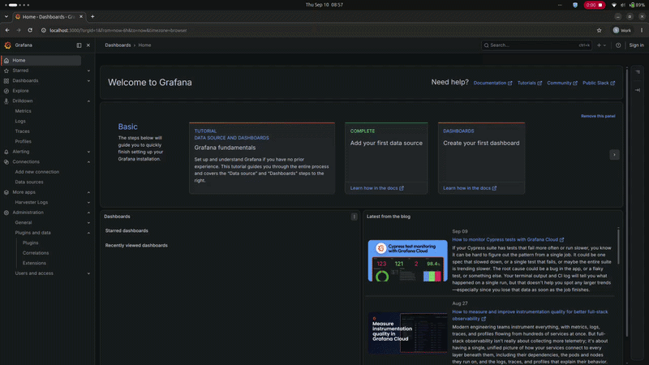

# Harv Logs

Harv Logs is a local analysis stack for Harvester support bundles. It extracts the bundle, expands node archives, sends the logs to Loki through Promtail,and provides a Grafana app for incident timeline and root-cause analysis.

The project is intended for support engineers who need to inspect a bundle without sending the raw logs to an external service. The optional AI features use Grafana's `grafana-llm-app` and therefore depend on that plugin's provider configuration and data-handling policies.

## See it in action



## How It Works

```text
Harvester support-bundle.zip
        |
        v
scripts/load-logs.sh
        |
        v
bundle-logs/ --> Promtail --> Loki --> Grafana + Harv Logs app
```

1. `make load BUNDLE=...` clears the previous extraction and unpacks the  support-bundle ZIP into `bundle-logs/`.
2. ZIP files found in `nodes` directories are expanded so node logs are available to the collector.
3. Docker Compose starts Loki, Promtail, and Grafana.
4. Promtail rereads the bundle and sends normalized log entries to Loki.
5. Grafana provisions the Loki datasource and loads the `harv-logs-app` app from `dist/`.
> Note: currently tool does not have a release therefore follow the [developer guide](grafana-plugin/CONTRIBUTOR.md) to build the plugin.

Promtail handles pod logs, node service logs, and root bundle logs. It extracts labels including `job`, `namespace`, `pod`, `container`, `node`, `service`, and `level`, and parses common JSON, logfmt, klog, and timestamped log formats.

## Requirements

For the local stack:

- Docker Engine with the Compose plugin (`docker compose`)
- GNU Make
- `unzip`, `curl`, `jq`, and `tar`
- A Harvester support-bundle ZIP file
- Network access to download the released plugin and container images

For plugin development:

- Node.js 22 or newer
- npm 11.16.0
- Go 1.26.5
- Mage

Support bundles can contain sensitive cluster data. Keep extracted files, Docker volumes, credentials, and AI-provider requests within your organization's data-handling policy. The extracted `bundle-logs/` directory and local plugin distribution are ignored by Git.

## Quick Start

From the repository root, load a bundle and start the stack:

```bash
make load BUNDLE=/absolute/path/to/support-bundle.zip
```

The command downloads the configured plugin release into `dist/`, extracts the bundle, builds and starts the Compose services,
resets Promtail's positions, and restarts Promtail for a full reread.

Open these local endpoints:

| Service | URL |
| --- | --- |
| Grafana | http://localhost:3000 |
| Promtail | http://localhost:9080 |

The Compose configuration enables Grafana anonymous Admin access for local development and disables basic authentication. Do not expose this stack to an untrusted network without changing that configuration.

## Make Commands

| Command | Purpose |
| --- | --- |
| `make help` | Show the available commands. |
| `make load BUNDLE=/path/bundle.zip` | Extract and ingest a support bundle. |
| `make up` | Start the Compose stack in the background. |
| `make down` | Stop the stack and remove its Compose volumes. |
| `make clean` | Remove extracted logs and the downloaded `dist/` plugin. |

The plugin archive URL is configured in the Makefile. Override it for a branch release when running `make load`, for example:

```bash
make HARV_LOGS_RELEASE_URL=https://github.com/wso2/open-cloud-datacenter/releases/download/branch-release/harv-logs-app-branch-release.tar.gz load BUNDLE=/path/to/support-bundle.zip
```

If `dist/` already exists, the download script leaves it unchanged. Remove it with `make clean` to force a fresh plugin download.

## Grafana App

The unsigned `harv-logs-app` Grafana app has two pages:

- **RCA** at `/a/harv-logs-app`: choose an incident window, query the configured Loki datasource across the relevant namespaces, review the correlated timeline, and generate an AI-assisted report or follow-up questions.
- **Configuration** at `/plugins/harv-logs-app`: manage plugin settings.

The RCA page reads `lokiDatasourceUid` and an optional `nodeLabel` from the plugin's JSON settings. The bundled datasource is provisioned with the UID `loki`. The current configuration form still contains the older API URL/API key fields, so RCA settings may need to be supplied through Grafana plugin settings or updated in the plugin UI before analysis can run.

The correlation rules are stored in
[`grafana-plugin/rules/rca-rules.yaml`](grafana-plugin/rules/rca-rules.yaml)
and are loaded by the backend. The backend exposes analysis, report streaming,
chat streaming, and rule-reload operations to the frontend.

Useful LogQL queries in Grafana Explore include:

```logql
{job=~"pod-logs-.*"}
{job="harvester-nodes"}
{level="error"}
{namespace="harvester-system"} |= "error"
```

For plugin developers, see the
[Grafana plugin development guide](grafana-plugin/README.md).

## Repository Layout

| Path | Purpose |
| --- | --- |
| `Makefile` | Local stack commands. |
| `docker-compose.yaml` | Loki, Promtail, and Grafana services. |
| `configs/` | Loki, Promtail, and Grafana datasource configuration. |
| `scripts/load-logs.sh` | Bundle extraction and ingestion workflow. |
| `scripts/download-plugin.sh` | Downloads a published plugin archive. |
| `grafana-plugin/pkg/` | Go backend for Loki queries, rules, timelines, and AI calls. |
| `grafana-plugin/src/` | React and TypeScript Grafana app. |
| `grafana-plugin/rules/` | RCA correlation rules. |
| `grafana-plugin/tests/` | Browser end-to-end tests. |
| `.github/workflows/publish-images.yml` | Builds and uploads plugin archives for published GitHub releases. |

Generated files such as `bundle-logs/`, `dist/`, `node_modules/`, and release
archives are intentionally excluded from version control.

## Troubleshooting

- Check service state with `docker compose ps`.
- Inspect ingestion with `docker compose logs promtail`.
- Reload another bundle with `make load BUNDLE=/path/to/another-bundle.zip`.
- Reset extracted data and the local plugin with `make clean`.
- Confirm Promtail is ready at http://localhost:9080/ has blue phrased logs.
- Set `HARV_LOGS_RELEASE_TAG` when the latest published plugin is not the one
  you need.
